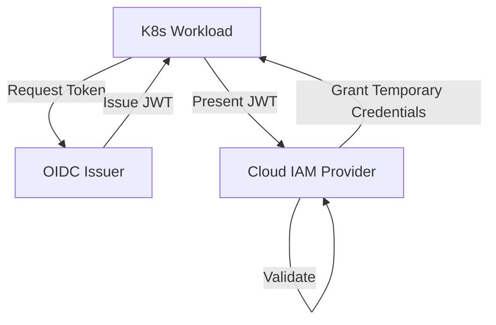
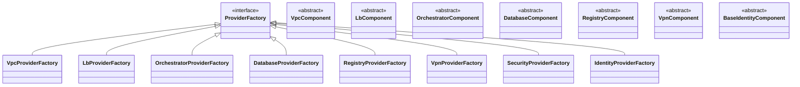

# Pulumi Multi-Cloud Infrastructure Framework

---

## 🇪🇸 Descripción (Español)

Este proyecto implementa una base de infraestructura multi-cloud (AWS, Azure, GCP) utilizando Pulumi y siguiendo las mejores prácticas de ingeniería de software. El objetivo es proporcionar un estándar de oro para la infraestructura como código (IaC), siendo modular, testeable y fácil de extender para topologías de red, balanceadores de carga, orquestación de Kubernetes, registros de contenedores, bases de datos administradas y federación de identidades.

El proyecto incorpora un enfoque riguroso de **desarrollo dirigido por especificaciones (Spec-Driven Development)**, gestionando el ciclo de vida de las características desde su conceptualización técnica hasta su implementación verificada.

### Arquitectura y Principios

- **Patrón Factory**: Utilizado en `infra/providers.py` para instanciar componentes según el proveedor seleccionado. Cumple con el principio Open/Closed (OCP).
- **ComponentResource**: Todos los recursos se agrupan en componentes lógicos de Pulumi, facilitando la organización y el seguimiento de dependencias (Parent/Child).
- **Configuración Tipada**: La clase `InfrastructureConfig` en `infra/config.py` centraliza y valida todos los parámetros de entrada.
- **SOLID**: Diseñado para SRP, OCP, LSP, ISP y DIP.

### Visualización de Arquitectura / Architecture Visualization

#### Estructura de Componentes (Factory Pattern) / Component Structure


#### Flujo de Federación de Identidad (Spec 009) / Identity Federation Flow


### Estructura del Proyecto

```text
.
├── infra/                  # Componentes de infraestructura (Basados en Factory)
│   ├── vpc/                # Topologías de red agnósticas (Tier-based)
│   ├── lb/                 # Balanceadores de carga externos
│   ├── orchestrator/       # Orquestación de computo (K8s)
│   ├── db/                 # Bases de datos administradas
│   ├── registry/           # Registros de contenedores seguros
│   ├── vpn/                # Conectividad VPN
│   ├── identity/           # Federación de identidades (Workload Identity)
│   ├── security/           # Componentes de seguridad/cumplimiento
│   ├── config.py           # Gestión de configuración tipada
│   └── providers.py        # Fábricas de componentes (Factory Pattern)
├── specs/                  # Especificaciones de características (SDD)
├── tests/                  # Suite de pruebas unitarias con mocks de Pulumi
├── main.py                 # Punto de entrada de Pulumi
└── requirements.txt        # Dependencias del proyecto
```

### Ramas de Desarrollo (Branches)

Resumen de los hitos implementados en cada rama:

- `main`: Infraestructura base y arquitectura de referencia multi-cloud.
- `create_constitution`: Definición de la gobernanza del proyecto y principios de ingeniería.
- `install_spec_kit`: Integración de herramientas para el desarrollo dirigido por especificaciones.
- `002-agnostic-vpc-topology`: Arquitectura de red agnóstica.
- `003_agnostic_external-lb-security`: Balanceadores de carga externos.
- `004-k8s-base-infra`: Infraestructura base para Kubernetes.
- `005-secure-multi-zone`: Configuración multi-zona segura.
- `006-secure-container-registry`: Registro de contenedores seguro.
- `006_isolated-managed-database`: Bases de datos administradas aisladas.
- `007_network-firewall-isolation`: Aislamiento de capas de red con firewalls.
- `008-secure-identity-federation`: Federación de identidades nativa (Workload Identity / IRSA).

---

## 🇺🇸 Description (English)

This project implements a multi-cloud infrastructure base (AWS, Azure, GCP) using Pulumi, following software engineering best practices. The goal is to provide a "gold standard" for Infrastructure as Code (IaC), being modular, testable, and easy to extend.

### Architecture and Principles

- **Factory Pattern**: Used in `infra/providers.py` to instantiate components based on the selected provider. Adheres to the Open/Closed Principle (OCP).
- **ComponentResource**: Resources are grouped into logical Pulumi components for organization and dependency management.
- **Typed Configuration**: `InfrastructureConfig` centralizes and validates input parameters.
- **SOLID**: Designed for SRP, OCP, LSP, ISP and DIP.

### Visualización de Arquitectura / Architecture Visualization

#### Estructura de Componentes (Factory Pattern) / Component Structure


#### Flujo de Federación de Identidad (Spec 009) / Identity Federation Flow


### Project Structure

```text
.
├── infra/                  # Infrastructure components (Factory-based)
│   ├── vpc/                # Agnostic network topologies
│   ├── lb/                 # External Load Balancers
│   ├── orchestrator/       # Kubernetes Orchestration
│   ├── db/                 # Managed Databases
│   ├── registry/           # Secure Container Registries
│   ├── vpn/                # VPN connectivity
│   ├── identity/           # Workload Identity Federation
│   ├── security/           # Security/Compliance components
│   ├── config.py           # Typed configuration management
│   └── providers.py        # Component Factories (Factory Pattern)
├── specs/                  # Feature specifications (SDD artifacts)
├── tests/                  # Unit testing suite with Pulumi mocks
├── main.py                 # Pulumi entry point
└── requirements.txt        # Project dependencies
```

### Development Branches

Summary of the evolution and milestones implemented in each branch:

- `main`: Core multi-cloud infrastructure base.
- `create_constitution`: Project governance definition and engineering principles.
- `install_spec_kit`: Integration of spec-driven development tools.
- `002-agnostic-vpc-topology`: Agnostic VPC topology implementation.
- `003_agnostic_external-lb-security`: External load balancer implementation.
- `004-k8s-base-infra`: Kubernetes base infrastructure.
- `005-secure-multi-zone`: Secure multi-zone environment configuration.
- `006-secure-container-registry`: Secure container registry implementation.
- `006_isolated-managed-database`: Isolated managed database implementation.
- `007_network-firewall-isolation`: Network firewall isolation implementation.
- `008-secure-identity-federation`: Native identity federation implementation (Workload Identity / IRSA).

### Unit Testing

The project includes a comprehensive testing suite utilizing Pulumi mocks to validate infrastructure logic without requiring real cloud credentials.

To run all tests:
```bash
$env:PYTHONPATH = "."
pytest
```

---

## 🚀 Cómo Extender / How to Extend

1.  **🇪🇸 ES**: Crea `infra/<componente>/<proveedor>_<tipo>.py` heredando de la clase base. Registra la nueva implementación en la fábrica correspondiente en `infra/providers.py`.
2.  **🇺🇸 EN**: Create `infra/<componente>/<provider>_<type>.py` inheriting from the abstract base class. Register the new implementation in the corresponding factory in `infra/providers.py`.
