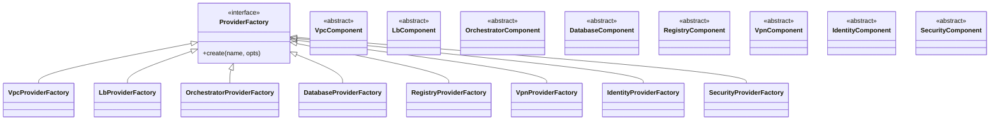
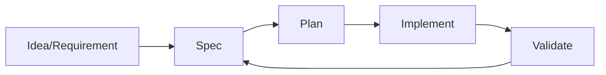

# Pulumi Multi-Cloud Infrastructure Framework

---

## 🇪🇸 Descripción (Español)

Este proyecto implementa una base de infraestructura multi-cloud (AWS, Azure, GCP) utilizando Pulumi y siguiendo las mejores prácticas de ingeniería de software. El objetivo es proporcionar un estándar de oro para la infraestructura como código (IaC), siendo modular, testeable y fácil de extender para topologías de red, balanceadores de carga, orquestación de Kubernetes, registros de contenedores, bases de datos administradas y federación de identidades.

El proyecto incorpora un enfoque riguroso de **desarrollo dirigido por especificaciones (Spec-Driven Development)**, gestionando el ciclo de vida de las características desde su conceptualización técnica hasta su implementación.

### Arquitectura y Principios

- **Patrón Factory**: Utilizado en `infra/providers.py` para instanciar componentes según el proveedor seleccionado. Cumple con el principio Open/Closed (OCP).
- **ComponentResource**: Todos los recursos se agrupan en componentes lógicos de Pulumi, facilitando la organización y el seguimiento de dependencias (Parent/Child).
- **Configuración Tipada**: La clase `InfrastructureConfig` en `infra/config.py` centraliza y valida todos los parámetros de entrada.
- **SOLID**: Diseñado para SRP, OCP, LSP, ISP y DIP.

### Visualización de Arquitectura / Architecture Visualization

#### Estructura de Componentes (Factory Pattern) / Component Structure


#### Flujo de Desarrollo Dirigido por Especificaciones (Spec-Driven Flow)


### Estructura del Proyecto

```text
.
├── infra/                  # Componentes de infraestructura
│   ├── db/                 # Bases de datos administradas
│   ├── identity/           # Federación de identidades
│   ├── lb/                 # Balanceadores de carga
│   ├── orchestrator/       # Orquestación de computo (K8s)
│   ├── registry/           # Registros de contenedores seguros
│   ├── security/           # Componentes de seguridad/cumplimiento
│   ├── vpc/                # Topologías de red
│   ├── vpn/                # Conectividad VPN
│   ├── config.py           # Gestión de configuración tipada
│   └── providers.py        # Fábricas de componentes
├── specs/                  # Especificaciones (SDD)
├── tests/                  # Suite de pruebas unitarias
└── main.py                 # Punto de entrada de Pulumi
```

### Ramas de Desarrollo (Branches)

Resumen de los hitos implementados en cada rama:

- `main`: Infraestructura base multi-cloud.
- `create_constitution`: Configuración inicial y normalización.
- `install_spec_kit`: Integración de desarrollo dirigido por especificaciones.
- `002-agnostic-vpc-topology`: Topologías de VPC agnósticas.
- `003_agnostic_external-lb-security`: Balanceadores de carga y seguridad.
- `004-k8s-base-infra`: Infraestructura base para Kubernetes.
- `005-secure-multi-zone`: Entornos multi-zona seguros.
- `006-secure-container-registry`: Registro de contenedores seguro.
- `006_isolated-managed-database`: Bases de datos aisladas.
- `007_network-firewall-isolation`: Aislamiento de red mediante firewalls.
- `008-secure-identity-federation`: Federación de identidades nativa.

---

## 🇺🇸 Description (English)

This project implements a multi-cloud infrastructure base (AWS, Azure, GCP) using Pulumi, following software engineering best practices. The goal is to provide a "gold standard" for Infrastructure as Code (IaC), being modular, testable, and easy to extend for network topologies, load balancers, Kubernetes orchestration, container registries, managed databases, and identity federation.

The project incorporates a rigorous approach to **Spec-Driven Development**, managing the feature lifecycle from technical conceptualization to implementation.

### Architecture and Principles

- **Factory Pattern**: Used across components to instantiate cloud-specific resources adhering to the Open/Closed Principle (OCP).
- **ComponentResource**: Resources are grouped into logical Pulumi components for organization and dependency management.
- **Typed Configuration**: `InfrastructureConfig` centralizes and validates input parameters.
- **SOLID**: Designed for SRP, OCP, LSP, ISP, and DIP.

### Visualización de Arquitectura / Architecture Visualization

#### Estructura de Componentes (Factory Pattern) / Component Structure


#### Flujo de Desarrollo Dirigido por Especificaciones (Spec-Driven Flow)


### Project Structure

```text
.
├── infra/                  # Infrastructure components
│   ├── db/                 # Managed Databases
│   ├── identity/           # Identity Federation
│   ├── lb/                 # Load Balancer implementations
│   ├── orchestrator/       # Compute orchestration (K8s)
│   ├── registry/           # Secure Container Registries
│   ├── security/           # Security/Compliance components
│   ├── vpc/                # Virtual Private Cloud topologies
│   ├── vpn/                # VPN connectivity
│   ├── config.py           # Typed configuration management
│   └── providers.py        # Component Factories
├── specs/                  # Specification-driven development artifacts
├── tests/                  # Unit testing suite with mocks
└── main.py                 # Pulumi entry point
```

### Development Branches

Summary of the evolution and milestones implemented in each branch:

- `main`: Core multi-cloud infrastructure base.
- `create_constitution`: Initial configuration and file normalization.
- `install_spec_kit`: Integration of spec-driven development methodology.
- `002-agnostic-vpc-topology`: Implementation of agnostic VPC topologies.
- `003_agnostic_external-lb-security`: Implementation of external load balancers and security policies.
- `004-k8s-base-infra`: Kubernetes base infrastructure.
- `005-secure-multi-zone`: Secure multi-zone environment configuration.
- `006-secure-container-registry`: Implementation of secure container registry.
- `006_isolated-managed-database`: Isolated managed database implementation.
- `007_network-firewall-isolation`: Network firewall isolation implementation.
- `008-secure-identity-federation`: Native identity federation implementation.

### Unit Testing

The project includes a comprehensive testing suite utilizing Pulumi mocks to validate infrastructure logic without requiring real cloud credentials.

To run all tests:
```bash
$env:PYTHONPATH = "."
pytest
```
